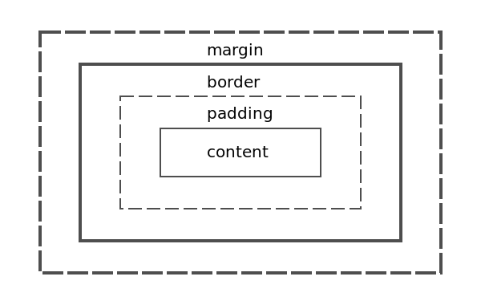

# 盒模型
<!-- toc -->

- [1、基本概念](#1、基本概念)
- [2、content-box](#2、content-box)
- [3、border-box](#3、border-box)

<!-- tocstop -->

## 1、**基本概念**
盒模型(box model)是CSS中的一个重要概念，它是元素大小的呈现方式。标准模型 box-sizing:content-box IE模型 box-sizing:border-box


## 2、content-box
布局所占宽度Width：
```
Width = width + padding-left + padding-right + border-left + border-right
```

## 3、border-box
布局所占宽度Width：
```
Width = width(包含padding-left + padding-right + border-left + border-right)
```
